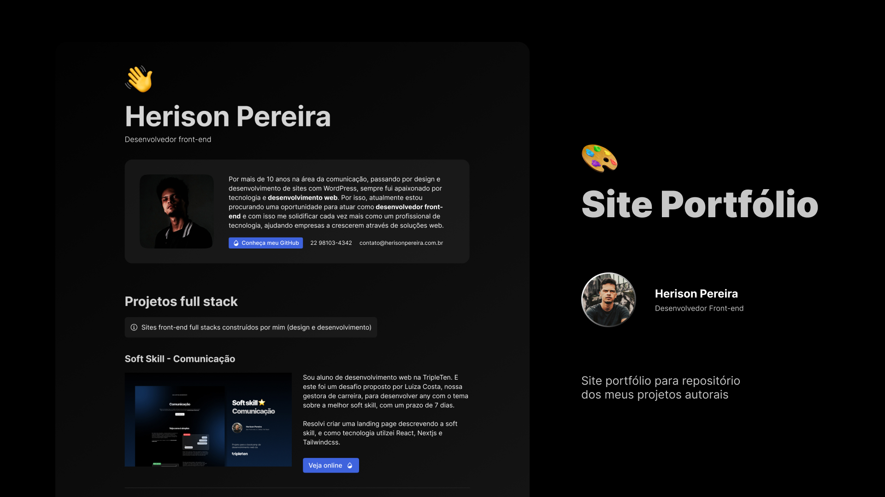

# Site portfólio

<a href="https://herisonpereira.vercel.app" target="_blank">👉 Veja online</a>

## 👁 Preview

<p align="center">
  
</p>

## 🚀 Tecnologias

Esse projeto foi desenvolvido com as seguintes tecnologias:

- React
- Next.js
- Typescript
- Tailwindcss
- Radix Themes
- Vercel
- Git e GitHub

## 💻 Projeto

Site desenvolvido para servir como repositório de fácil acesso para meus principais projetos autoriais.

Maior desafio que encontrei aqui foi trabalhar com os components do Radix, visto que ainda não tinha utilizado. Apesar de estar utilizando chamadas API com fetch do Nextjs, não estou trabalhando com um banco de dados, mas quis simular como se tivesse, para uma melhoria futura não precisar refatorar tanto o código.

Como sempre curti o design, não pude deixar de criar um layout totalmente do zero. Vale ressaltar que utilizei o style guide do próprio Radix para criar o layout no Figma, isso poupou bastante tempo de criação e do desenvolvimento, possibilitando fazer todo o processo de layout e desenvolvimento em apenas 1 dia 🎈.

Espero que goste! 👉 [ver online](https://herisonpereira.vercel.app)

## Getting Started

Primeiro, inicie o servidor de desenvolvimento:

```bash
npm run dev
# or
yarn dev
# or
pnpm dev
# or
bun dev
```

Abra [http://localhost:3000](http://localhost:3000) com seu navegador para ver o resultado.
